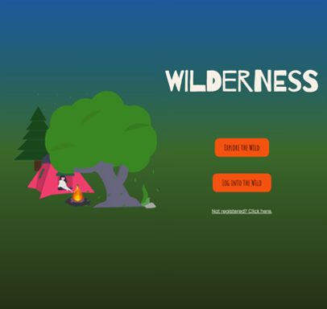

# Wilderness - Project 3



All credit to Alex Nicholas and Ali Bhimani for the code they contributed to the project, moreover their creative insights and programming skill; they, both, are a pleasure to work with.

## Contents

- [Contents](#contents)
- [Brief](#brief)
- [Approach](#approach)
- [Technologies Used](#technologies-used)
- [Wireframe](#wireframe)
- [Responsibilities and Code Review](#responsibilities-and-code-review)
  - [Data Mining](#data-mining)
  - [Campground Page](#campground-page)
  - [React Context API](#react-context-api)
  - [User Preferences](#user-preferences)  
  - [Cloudinary](#cloudinary)
- [Key Learnings](#key-learnings)
- [Challenges](#challenges)
- [Conclusions and Achievements](#conclusions-and-achievements)
- [Bugs](#bugs)

## Brief

Build a full-stack MERN web application and deploy to Heroku. Use an Express API to serve data from a MongoDB database, consuming the data on a front end built with React. Combine this with a public API to supplement the data presented on the front end. Implement thoughtful wireframes/user stories to establish core MVP. Deliver a visually impressive design. Automate testing on at least one RESTful resource on the back end. Code collaboratively using source control (GitHub) to resolve any conflicts.


## Approach

After researching a number of public APIs, we delved deeper into https://ridb.recreation.gov/, an American government website listing "rec areas"—i.e. points of interest such as national parks—and "facilities", which encompassed campgrounds. The API was easy to navigate and utilise. We decided to build a camping app which would enable people to discover rec areas in any US state and find campgrounds and hotels nearby. The project timeline for this website application was 1 week: initially we started with the planning stages, including building a wireframe, then we continued with configuring the backend. After, we moved on to constructing the frontend code. As the collaboration was largely remote we communicated through the use of online video conferencing applications.

## Technologies Used
- HTML; CSS/Sass; JavaScript; React
- Node.js, inc. `fs` module; Mongoose; Express; Cloudinary
- Axios; bcrypt; Json Web Token; Mapbox
- React Hook Form; React Tabs; Yup; Mocha
- Chai; FontAwesome

## Wireframe

To aid our front-end logic and distribution of responsibilities, we constructed a wireframe that detailed the user journey.


- [View Prototype (figma.com)](https://www.figma.com/proto/j1Ma7hLvkwkZHrXgt4odsO/Wilderness?node-id=3%3A3&viewport=116%2C351%2C0.11993156373500824&scaling=scale-down)

## Responsibilities and Code Review

We resolved to work collaboratively wherever possible and maintained contact throughout development using conferencing apps. For efficiency, we did of course allocate certain responsibilities to individuals on a modular basis.

### Data Mining

A challenge from the outset was the limit set by the RIDB API on the number of results any one request could return. There were thousands of points of interest and many more campgrounds. An alternate method was the utilisation of a database dump, approximating around 500MB, also available from RIDB. As a team we all opted to pursue the avenue of seeding the data, to then be able to tailor it to our needs.

An advantage of this approach was that filtering of the data could be applied before storage in our backend. Also quality control could be applied to ensure a consistent and predictable user experience. For example, users always had a point of contact for the campgrounds as this information was checked beforehand and served onto the front end. The following code was written by Alex Nicholas. The code relies upon filtering and mapping the data usable files that could be seeded into our database, see [./server/data/recAreaFilter.js](https://github.com/RichardBekoe/Wilderness/blob/master/server/data/recAreaFilter.js) and [./server/data/facilitiesFilter.js](https://github.com/RichardBekoe/Wilderness/blob/master/server/data/facilitiesFilter.js) .


### Campground Page

To facilitate navigation and in response to bugs with the user clicking the browser back button, a RegEx solution was implemented. The URL was extracted to identify the site Id, to hence make the appropriate API call. The reviewViaStarRating function redirects the user to the page where they can leave a rating and passes the site details in state.

I researched and outsourced a camping themed GIF which could be used while the API call for the relevant campground is being made. Details for each campground are displayed with varying conditional logic depending on whether the user is logged in and whether the campground has certain attributes (such as being accessible by car). The campground's reviews are also listed on the page and a logged-in user has the ability to leave their own review.

Link - [Referenced Code](https://github.com/RichardBekoe/Wilderness/blob/master/src/components/SingleCampground.js)

### React Context API

Since the presence of a users login status was available from the use of JWT and local storage, the app was able to utilise conditional rendering and activate user preferences. Our team ultimately leveraged the use of context API to facilitate access to the current user's details across different pages of the application.

Link - [Referenced Code](https://github.com/RichardBekoe/Wilderness/blob/master/src/components/Context.js)


### User Preferences

The following code demonstrates how user preferences were stored within the application. This functionality allows a user to update and save their display options. This includes a function which saves a user home state; following this, another function which updates and saves this value, attributing the data to the user for future use. Also, an application dark mode was implemented for ease of the website's usability in different environments.

Link - [Referenced Code](https://github.com/RichardBekoe/Wilderness/blob/master/src/components/Settings.js)


### Cloudinary

The Cloudinary API was implemented to allow users to change their avatars on the app. The Cloudinary widget was imported in the body of our index.html which allowed for straightforward access to the global window object from within React to open the image upload widget:

``` javascript
function handleAvatarClick() {
    console.log('Line 40')
    window.cloudinary.createUploadWidget(
      {
        cloudName: 'wilderness',
        uploadPreset: 'wild_app',
        cropping: true,
        croppingAspectRatio: 1,
        googleApiKey: process.env.GOOGLE_IMAGE_SEARCH_API_KEY
      },
      (err, result) => {
        setAvatar(result.info.secure_url)
      }
    ).open()
  }

```

Link - [Referenced Code](https://github.com/RichardBekoe/Wilderness/blob/master/src/components/MyAccount.js)


## Key Learnings

The are a several skills that I have developed during this project. Working as a team and utilising git helped to provide practical experience which helped to consolidate previous knowledge. In addition, I learned how communication with team members irrespective of the use of computer tools aids to provide clear direction especially with respect to a fast moving, rapidly developing project.

Preparation of the source of data that the application relies on, was a crucial stage in the development of the application. The quality of the data was filtered and checked. The value of testing the application was also important to ensure the user experience was to a high standard and functioned as we expected.

## Challenges

Working with a large amount of data insofar as finding anomalous data points was concerned. The site descriptions lacked consistency and it was a challenge trying to account for the various anomalous patterns that could occur. Working with large amounts of data was a challenge, although I feel that I handled such contributions well. The camground site descriptions lacked consistency and due to the broad variation in the type of data it required additional time and attention.

## Conclusions and Achievements

Overall I am very pleased with the outcome of our project work, of which was completed under fixed time constraints. I am appreciative of the team's determination to achieve the high standard that is demonstrated. Additional libraries which I had not previously used prior to the project were explored and successfully implemented. Throughout the application the use of context allowed personalisation and these settings were stored for future use via user settings. This therefore would increase user interaction and engagement with our application.

## Bugs

We spent a significant amount of time testing this application therefore, I feel that it is largely bug free and functions as we aspect. However,  despite the filtering and data corrections, on occasions there are places were the data source presents unexpected or unformatted data.


