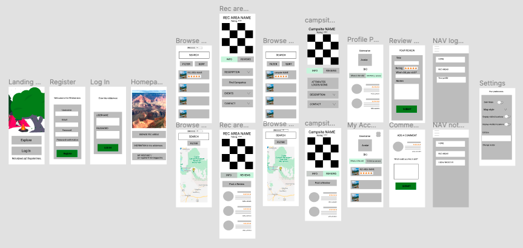

# Wilderness - Project 3

All credit to Alex Nicholas and Ali Bhimani for the code they contributed to the project, moreover their creative insights and programming skill. They are a pleasure to work with.

## Contents

- [Contents](#contents)
- [Brief](#brief)
- [Approach](#approach)
- [Technologies Used](#technologies-used)
- [Wireframe](#wireframe)
- [Responsibilities](#responsibilities)
  - [Data Mining](#data-mining)
  - [SVG Animation](#svg-animation)
  - [Campground Page](#campground-page)
  - [React Context API](#react-context-api)
  - [Cloudinary](#cloudinary)
  - [User Preferences](#user-preferences)
- [Key Learnings](#key-learnings)
- [Achievements](#achievements)
- [Challenges](#challenges)
- [Conclusions](#conclusions)

## Brief

Build a full-stack MERN web application and deploy to Heroku. Use an Express API to serve data from a MongoDB database, consuming the data on a front end built with React. Combine this with a public API to supplement the data presented on the front end. Implement thoughtful wireframes/user stories to establish core MVP. Deliver a visually impressive design. Automate testing on at least one RESTful resource on the back end. Code collaboratively using source control (GitHub) to resolve any conflicts.

## Approach

After researching a number of public APIs, we delved deeper into https://ridb.recreation.gov/, an American government website listing "rec areas"—i.e. points of interest such as national parks—and "facilities", which encompassed campgrounds. The API was easy to navigate and utilise. We decided to build a camping app which would enable people to discover rec areas in any US state and find campgrounds and hotels nearby.

## Technologies Used
- HTML; CSS/Sass; JavaScript; React
- Node.js, inc. `fs` module; Mongoose; Express; Cloudinary
- Axios; bcrypt; Json Web Token; Mapbox
- React Hook Form; React Tabs; Yup; Mocha
- Chai; FontAwesome

## Wireframe

To aid our front-end logic and distribution of responsibilities, we constructed a wireframe that detailed the user journey.

- [View Prototype (figma.com)](https://www.figma.com/proto/j1Ma7hLvkwkZHrXgt4odsO/Wilderness?node-id=3%3A3&viewport=116%2C351%2C0.11993156373500824&scaling=scale-down)

